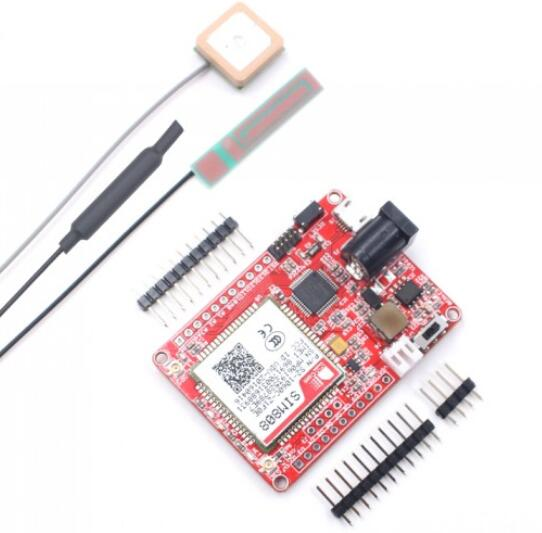

# Maduino Zero SIM808 GPS Tracker

```c++
/*
Version:		V1.0
Author:			Vincent
Create Date:	2022/12/30
Note:
	
*/
```



[toc]

# Makerfabs

[Makerfabs home page](https://www.makerfabs.com/)

[Makerfabs Wiki](https://wiki.makerfabs.com/)

# Maduino Zero SIM808 GPS Tracker
## Intruduce

Product Link ：[Maduino Zero SIM808 GPS Tracker V3.5](https://www.makerfabs.com/maduino-zero-sim808-gps-tracker-v3.5.html) 

Wiki Link : [Maduino Zero SIM808 GPS Tracker](https://wiki.makerfabs.com/Maduino_Zero_SIM808_GPS_Tracker.html) 


## Feature

- BAT Input Voltage: 3.4-4.2V
- DC jack Input: 5~12V, 2A at least
- Microcontroller: ATSAMD21G18, 32-Bit ARM Cortex M0+
- Clock Speed: 48 MHz
- Micro SIM connector
- GPS/GPRS/GSM/Bluetooth integrated solution
- Integrated Power Control System
- AT command interface with "auto baud" detection Quad-band: 850/900/1800/1900Mz


# Code

## Compiler Options

**If you have any questions，such as how to install the development board, how to download the code, how to install the library. Please refer to :[Makerfabs_FAQ](https://github.com/Makerfabs/Makerfabs_FAQ)**

- Install board : **Arduino Zero**.
- Upload codes, select **Arduino/Genuino Zero(Native USB port)** 

