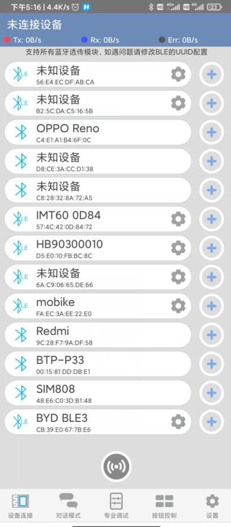
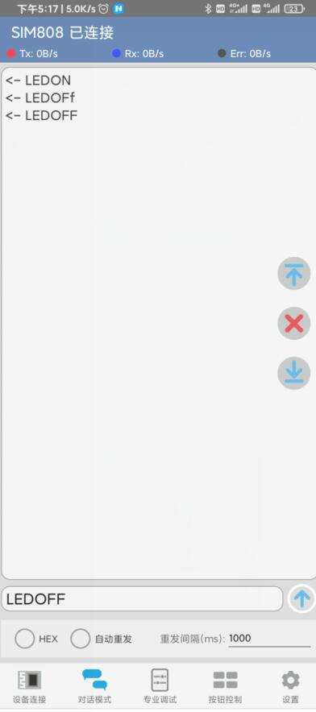
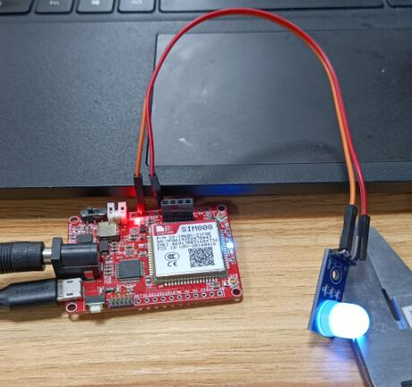
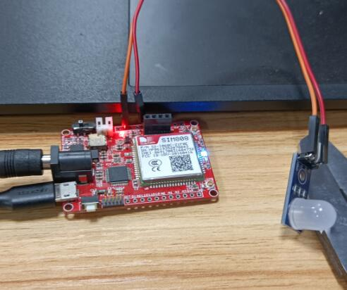

# Maduino Zero SIM808 GPS Tracker v3.5 

## BLE Demo

### Descrption
Connect to Bluetooth via the AT command.Use the Bluetooth serial port assistant to control the IO port to light the LED light.

### Step

- Upload code to Maduion Zero.
- Connect LED GND to Maduino GND and anode to D8. 
- Turn off the power switch and turn it on in two seconds.
- Open the Serial port monitor for the Arduino IDE.
- SIM808 will automatically initialize and turn on the Bluetooth switch.

```c

16:52:18.256 -> Start to run!
16:52:18.256 -> SIM808 opened
16:52:19.232 -> 
16:52:20.232 -> SIM808 opened
16:52:21.236 -> 
16:52:23.235 -> at+btpower=1
16:52:27.265 -> 
16:52:27.265 -> OK

```

- Open the Bluetooth debugging assistant of your mobile phone, and please find a similar app in the mobile phone application market.
- Search for nearby devices and find SIM808.



- Click Connect.(First connection needs to be matched, click OK)
- Marduino Zero has been set up to automatically connect requests.The serial port prints the following information.


```c

16:52:41.378 -> at+btpair=1,1
16:52:41.378 -> OK
16:52:41.378 -> 
16:52:41.378 -> +BTPAIR: 1,"xxx's Redmi 10X",e0:1f:88:db:c3:xx
16:52:41.378 -> 
16:52:41.378 -> +BTCONNECT: 1,"xxx's Redm",e0:1f:88:db:c3:xx,"HFP"
16:52:41.378 -> 
16:52:41.378 -> [CMD]PAIR!
16:52:41.378 -> 
16:52:41.378 -> +BTPAIRING: "xxx's Redmi 10X",e0:1f:88:db:c3:xx,477544
16:52:41.378 -> 
16:52:56.146 -> AT+BTACPT=1
16:52:56.146 -> OK
16:52:56.146 -> 
16:52:56.146 -> +BTCONNECT: 2,"xxx's Redm",e0:1f:88:db:c3:xx,"SPP"
16:52:56.146 -> 
16:52:56.146 -> [CMD]CONNECTING!
16:52:56.146 -> 
16:52:56.146 -> +BTCONNECTING: "e0:1f:88:db:c3:3f","SPP"

```

- Open the text transfer mode of the serial port assistant.
- Input "LEDON".
- LED will turn on.



```c
16:53:09.940 -> [CMD]LEDON
16:53:09.974 -> 
16:53:09.974 -> +BTSPPDATA: 2,5,LEDON

```



- Input "LEDOF".
- LED will turn off.

```c

16:53:17.902 -> [CMD]LEDOFF
16:53:17.902 -> 
16:53:17.902 -> +BTSPPDATA: 2,6,LEDOFF

```



### Code Explain
- AT+BTPOWER=1
Turn on bluetooth power.

- AT+BTPAIR=1,1
Accept matching request.

- AT+BTACPT=1
Accept a connection request.
The phone needs to be paired and connected to SIM808 for the first time.Then you just need to connect.